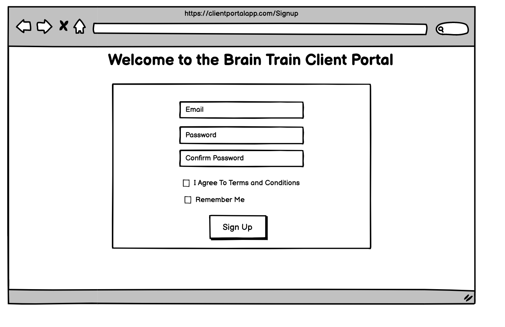
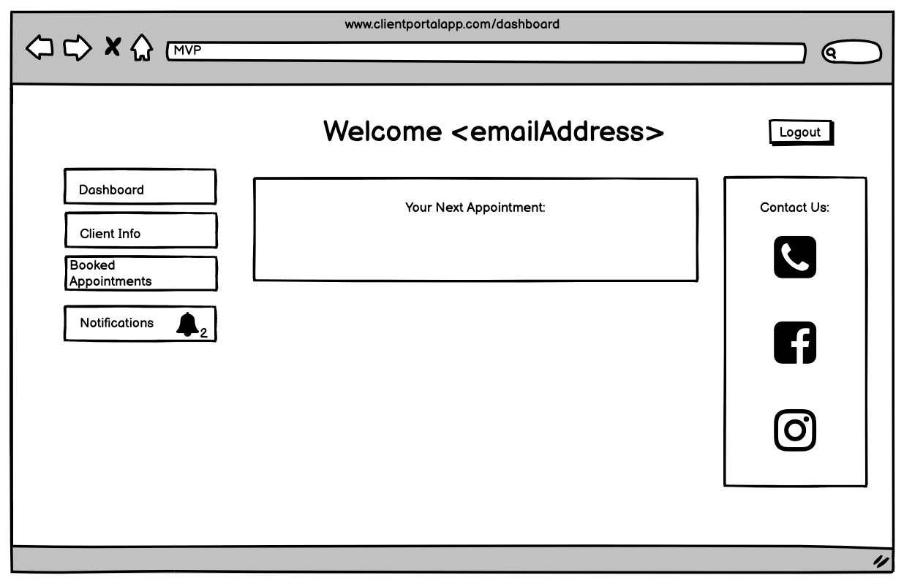

## Purpose

The aim for the MERN assessment is to create a Client Portal App for Clients of a local Allied Health Company. The MVP for the portal is that clients will be able to see their upcoming appointments, submit ticket requests to administration to change their appointments, view and edit their personal details. For additional requirements, there will be forum where users can create threads and comments.

## Functionality / features

The application would need to use a system of authentication by using a login system. The features of Login, Signup, Signout and Change Password have to be implemented. The bcrypt package has to be used to encrypt the users password on the database. There is also need of authorization to be implemented to distinguish between users (clients) and admin.

Once the users are signed in, they can read and update the personal information. The data for this would be stored on mongo and have functions for CRUD operations. If information already exists in the database, the user entry is set with the initial value. When the user updates their information it both updates the mongo database and Cliniko.

The user is able to read their appointment information on the dashboard and the view all appointments page. The information will be available through the Cliniko API where it can be read. In the appointment page, they can create change/remove requests for their appointments. 

Admin can receive notifications of change requests and contact the user with the information displayed. Admin can change the status of the request sending a notification to the user portal.

With the forum section of the app, there would be CRUD capabilities for users and admin to make threads and comments.
Admin ability to pin a forum post, turn off posting on a thread, delete all users threads and posts, block a user from the forum.
    
## Target audience

The target audience for the app is the clients that have appointments and the admin of the website. The needs of the client is to view and update their details, view their appointments and submit change requests. The needs of the admin is being able to manage bookings of the client.

## Tech stack

* Mongo
* Express
* React
* Node
    
## Dataflow diagram

## Application Architecture diagram

## User Stories

1. The Client Portal Login

    When the client engages with the company they provide their email address and book multiple appointments.
    
    To use the client portal the user clicks on the 'signup' button, using the same email address they used for their initial consultation with the company. 
    Once signed up user can login and logout at any time.

    Users will be able to change their password in case they forget, or in case of a security breach. To change a password, the client must simply click 'forgot password' on the login page, enter their email, and an email with password reset capabilities will be sent to their email address. 

2. Features of the Portal

    Once logged in users will land on the dashboard. The dashboard will display their next appointment, a left-side-nav bar, and a right side 'contact' bar with links to the companies phone number (click to call on mobile devices), facebook, and instagram. From the nav-bar users can navigate to view their upcoming appointments, see their client information, and their notifications.

3. Client Information

    Once logged in, if a user changes their address, phone number(s), or would like to change their emergency contact information, they can do so through the portal, which will automatically update the company's client file. They can do this by navigating to the client information page and clicking edit; changing the information and clicking save.

2. Request to Change an Appointment

    If a user sees an appointment that no longer suits them, they are able to submit a request to reschedule or cancel an appointment. This request can be made by navigating to the 'booked appointments' page and clicking 'Request to Edit/cancel' alongside the appointment that the user would like to change. The user is then be asked to confirm this decision. Once clicked, the request is sent to the administration team who will call the user back in order change the time of/cancel the appointment. 
    
    Notifications 
        The purpose of the notifications page is to alllow users to see all pending and completed requests for changes to their appointment(s). Requests are updated when the administration team changes the status from 'pending' to 'completed' via the admin login of the portal.

4. Admin Portal

    Once logged in using their company email address, admin can see all pending requests from users and all completed requests from the last 30 days in a table. Completed requests older than 30 days are automatically archived. The table displays client name, phone number, email, appointment time, appointment date, client city and whether the request is pending or completed. Admin are able to sort the table via whether a request is pending or completed, the city of the appointment, date of the appointment, appointment type, and name in alphabetical order. Once a user has been contacted, admin can change the appointment from 'pending' to 'completed'. If an appointment is changed via the business software (Cliniko), the request is automatically changed to completed. This will ensure that there is no 'double handling' of requests, if made via more than one avenue e.g. request made by phone and online. 

5. Forum

    An additional feature beyond the MVP would include a forum. Users and admin would be able to navigate to the forum from the right-side-nav-bar. Users and Admin can click on the 'new thread' button to create a new thread, 'comment' to comment on any existing thread, 'reply' to reply to an existing comment on a thread, and click on emoji's to 'react' to a thread, comment, or reply. 
    Users and admin will also have the ability to 'bump' threads up or down the forum board, by clicking the up-arrow if they want the thread to move up, or the down-arrow if they think the thread should move down. The cumulative bumps across users will determine the position of a thread on the board.
    In the right-side-nav-bar users and admin can navigate to notifications, which will display notifications of comments and replies in response to a user thread, comment or reply. If a user is blocked from the forum, a notification will also appear here.
    Admin will also have added buttons on threads, comments, and replies to 'pin' a them to the top of the board (thread level only), 'pause/unpause' to turn commenting on or off (thread level only), 'delete' for deleting threads, comments, or replies, and 'block user' to block a user from the forum. Pop-ups will confirm or cancel any of these actions once clicked. When blocking a user there will also be a prompt to ask for a reason for blocking the user.
    Admin will also be able to manage the forum users by clicking 'manage users' on the right-side-nav-bar where a list of all current forum users past and present exists. From here admin can block or delete a user, or delete all threads and comments of a user. When deleting a user there will also be a prompt to ask for a reason for deleting the user.
    Admin can see a list of currently blocked users, the date and reason they were blocked, with the ability to unblock them by clicking 'blocked users' on the right-side-nav-bar.

## Wireframes

## Trello board

